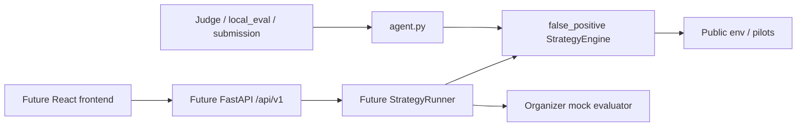

# False Positive

Hackathon team repository for Sib — команда **False Positive**, кейс HackAlem
«Агент управления тарифными маркетинговыми кампаниями Beeline».

Агент помогает аналитику маркетинга выбрать аудиторию, целевой тариф и канал
коммуникации при ограниченных бюджете и охвате. Он проверяет гипотезы пилотами
и возвращает план кампаний. Данные кейса синтетические: это не показатели
реального бизнеса Beeline.

## Состояние

| Слой | Статус | Что есть |
|---|---|---|
| Architecture / Core | DONE | Судейский Agent, простой baseline/fallback, trace, тесты |
| Frontend | NOT_STARTED | OpenAPI, fixtures, README и role prompt; приложения нет |
| Backend | NOT_STARTED | Контракт и инструкции; работающего API нет |
| End-to-end integration | NOT_STARTED | Промпт проверки будущих UI/API |

44 тестов пройдены; официальный evaluator выполняет 3 пилота и возвращает
валидный финальный план. В 10 mock-прогонах 6 прибыльных: baseline нестабилен,
не является финальной оптимизационной стратегией. Score скрытой среды неизвестен.
Текущее состояние и фактические проверки: [PROJECT_STATE](docs/PROJECT_STATE.md).

## Архитектура



Judge запускается без API, UI, сервера, БД, аккаунта и сети. Baseline использует
публичные группы профиля, ближайший более дорогой тариф, самый дешёвый канал,
до трёх пилотов и выбор по наблюдаемому эффекту. Если все пилоты отрицательные
или не удались, возвращает одну доступную кампанию. См. [архитектуру](docs/ARCHITECTURE.md).

```text
agent.py                    судейский adapter
false_positive/             domain, strategy, advisors, observability
contracts/                  OpenAPI v1, JSON Schema, fixtures
tests/                      контракт Agent, модели, API fixtures
scripts/                    verifier и генератор fixtures
docs/                       решения, state, progress, ownership, handoff
.codex/prompts/             Frontend, Backend, Integration
frontend/, backend/         пока только README будущих этапов
data/, customer_profile.csv  неизменяемые данные организатора
local_eval.py               официальный evaluator
make_submission.py          официальный генератор submission.csv
```

## Технологии и требования

Проверено на Windows с **Python 3.13.15**, pandas 2.3.3, NumPy 2.5.3.
Core использует dataclass/Protocol и публичные pandas DataFrame среды.
Проверки: pytest 9.1.1, jsonschema 4.26.0, PyYAML 6.0.3,
openapi-spec-validator 0.7.2. Runtime и dev-зависимости разделены.
`requirements-dev.lock` фиксирует весь установленный набор для повторения
этой проверки. Сеть нужна для первоначальной установки пакетов, не для Agent.

Node/npm пока не использованы и не проверены. React/Vite/TypeScript и FastAPI
— выбор для следующих этапов, не текущие зависимости.
Команды Linux/macOS приведены для стандартного venv; на этих ОС не запускались.

## Установка judge/core

Запускайте команды из корня репозитория, где находятся CSV и `data/`.
Все файлы организатора уже включены; SHA256 проверяет verifier.

Windows PowerShell:

```powershell
py -3.13 -m venv .venv
.\.venv\Scripts\python.exe -m pip install -r requirements-dev.lock
.\.venv\Scripts\Activate.ps1
```

Если политика PowerShell запрещает activation, её менять не требуется:
замените `python` в следующих командах на `.\.venv\Scripts\python.exe`.
Если `py` отсутствует, используйте установленный `python` для создания venv.

Linux/macOS:

```sh
python3 -m venv .venv
. .venv/bin/activate
python -m pip install -r requirements-dev.lock
```

Для одного судейского запуска без тестов достаточно
`python -m pip install -r requirements.txt`. Dev manifest —
`requirements-dev.txt`; lock содержит версии bootstrap, включая транзитивные.

## Судейский запуск и submission

```sh
python local_eval.py
python local_eval.py --runs 10
python make_submission.py
```

Успешная техническая проверка: Agent не падает, проводится >0 пилотов,
возвращается 1–10 финальных кампаний, нет «Кампания … отброшена», лимиты
бюджета/контактов соблюдены. `local_eval` умеет перехватывать ошибки и вернуть
exit code 0 даже при проблеме; поэтому нужен verifier и прямые тесты Agent.
Финансовый `Статус: FAIL` означает отрицательный net, а не падение процесса.

В прогоне seed=42: 3 пилота + 1 финальная кампания, 1 285 контактов, стоимость
0, net около +4 042. Напечатанный evaluator счётчик «Кампаний: 4» включает
пилоты. Его остаток охвата 14 700 относится только к пилотам; после финала
остаток 13 715. Подробная API-семантика — [contracts/README](contracts/README.md).

`make_submission.py` использует seed=42 и создаёт текущий `submission.csv`.
Повторные результаты совпали побайтно. Сдаётся весь пакет core, а не только
тонкий `agent.py`, плюс CSV и requirements. При изменении core обновить CSV.

## Проверки

```sh
python -m pytest
python scripts/verify_core.py
git diff --check
git status --short
```

Verifier проверяет SHA256 исходников организатора, core/contract tests,
официальный evaluator, 10 seed и повторную генерацию submission. При ошибке
возвращает ненулевой код; подходит для pre-flight каждой Codex-сессии.
Существующий submission сохраняется даже при ошибке генератора. Если его
содержимое отличается от нового результата, verifier завершится ошибкой;
после review явно запустите make_submission для обновления файла.
При сравнении с существующим CSV различие LF/CRLF допускается; две новые
генерации сравниваются побайтно.
Тесты контролируют реальную зависимость решения от пилотных наблюдений,
fallback, сбои advisor/observer, лимиты, детерминизм и OpenAPI.

## API и дальнейшие этапы

Источник истины: [OpenAPI v1](contracts/openapi.yaml),
[Campaign schema](contracts/campaign.schema.json),
[fixtures](contracts/examples/). Endpoint: health, case/summary,
POST runs, GET runs/{run_id} под `/api/v1`. Это контракт, не запущенный сервер.
Fixtures отмечены `source: mock_fixture`; completed пример сконструирован,
не является выводом Agent. Summary агрегирован из публичных CSV.

Frontend сначала реализует UI аналитика с mock/HTTP transports, используя
`VITE_USE_MOCKS` и `VITE_API_BASE_URL`. Backend затем реализует FastAPI
`backend.app.main:app`, общий StrategyRunner, официальный mock evaluator и
строго тот контракт, который использует UI. Integration проверит оба контура.
Инструкции: [Frontend](frontend/README.md), [Backend](backend/README.md).

## Окружение, аккаунты и сторонние компоненты

Baseline не читает переменные окружения, `.env` или `OPENAI_API_KEY`.
В `.env.example` нет неиспользуемых ключей. Личная подписка не нужна.
Runtime-LLM отсутствует; есть только необязательный DecisionAdvisor protocol.
Будущая LLM-интеграция требует timeout, лимита вызовов, валидации и fallback.

Сторонний код, пакеты и синтетические данные раскрыты в
[THIRD_PARTY_NOTICES](THIRD_PARTY_NOTICES.md). Bootstrap написан при помощи
Codex; независимый read-only AI review проверял границы и семантику scorer.
Указанные тесты реально запускались, решения и изменения проверяет человек.

## Роли и последовательная работа

Участник 1 — ARCHITECT/CORE, участник 2 — FRONTEND, участник 3 — BACKEND;
участник 1 или команда — INTEGRATION. Имена/аккаунты не предполагаются.
У независимых Codex-сессий нет общей памяти; её заменяют AGENTS, ADR,
PROJECT_STATE, PROGRESS и неизменяемые handoff. См. [COLLABORATION](docs/COLLABORATION.md)
и [OWNERSHIP](docs/OWNERSHIP.md).

Каждый новый участник после подтверждённого предыдущего push выполняет:

```sh
git checkout main
git pull --ff-only origin main
git status --short
```

Затем читает AGENTS и документы в указанном порядке, выполняет pre-flight,
работает по role prompt, проверяет результат и обновляет память. Commit/push
делает человек. При неожиданной истории — inspect и согласование, без force.
В текущей сессии внешний commit/merge уже появился во время bootstrap;
он проверен и сохранён. Финальные файлы документации требуют нового review.

## Ограничения и troubleshooting

- 6/10 mock-прогонов прибыльны, 4 отрицательны; никакой гарантии hidden score.
- Пять строк без ARPU-сегмента, 110 без data-сегмента: summary показывает
  UNKNOWN, core не использует строки с отсутствующими сегментами для ячеек.
- Fallback требует непустую доступную ячейку ≤5000 и действующие справочники.
  Поведение при полностью испорченной/исчерпанной среде — явная ошибка.
- `ModuleNotFoundError`: установите requirements в тот же Python, которым
  запускаете команды; tests требуют dev dependencies.
- `python` не найден в Windows: используйте `py -3.13` или venv executable.
- CSV не найден: вернитесь в корень. Verifier сам устанавливает cwd для
  subprocess, официальные отдельные команды ожидают корень.
- Integrity mismatch: сравните исходный пакет и manifest; не изменяйте hash,
  чтобы скрыть проблему. `.gitattributes` сохраняет байты организатора.
- UI/API команды пока не работают: соответствующие этапы NOT_STARTED.
- Основное положение HackAlem отдельно отсутствует; перед сдачей проверить
  его требования, если команда его получит.

## Checklist передачи и сдачи

Перед Frontend: core verifier, review новых файлов, корректный state/handoff,
человеческий commit/push; следующий участник читает
[02-frontend prompt](.codex/prompts/02-frontend.md).

Перед финальной сдачей: judge отдельно без demo; повторяемый submission;
полный UI → HTTP API → core сценарий; contract/build/backend tests;
актуальные README/notices/state; отсутствие секретов и ложных claims;
целостность organizer файлов; финальные review/commit/push человеком.
