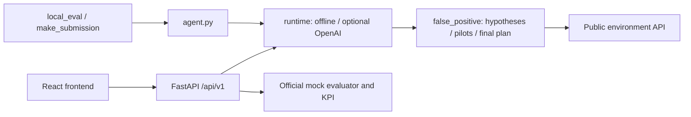

# False Positive — Beeline Tariff Marketing Campaigns

Агент решает, каким абонентам предложить смену тарифа, какой тариф и канал
выбрать. В кейсе 23 441 абонент, бюджет 100 000 у.е., максимум 15 000 контактов
и 20 пилотов. Пилоты и финальные кампании расходуют общие ресурсы. Итог —
1–10 кампаний; критерий — прирост ARPU за вычетом затрат на коммуникации.

Текущий агент строит гипотезы по публичным сегментам и ценам, проводит до
20 пилотов с повторными подтверждениями и масштабирует подтверждённые
кампании. При отсутствии подтверждений выбирает минимальный доступный
fallback. По умолчанию работает без сети. Опциональный OpenAI-советник
меняет порядок гипотез; решения о запуске по-прежнему проверяются пилотами.

Работают два контура:

- Judge: `agent.py:Agent.act(env) -> list[dict]`, независимое ядро `false_positive/`.
- Demo: FastAPI `backend.app.main:app`, четыре endpoint `/api/v1`, отдельная
  mock-среда на запуск и официальный evaluator для KPI. React frontend
  реализован; сквозная проверка UI с текущим backend ещё не выполнена.

## Архитектура и принцип работы



1. Агент получает публичные данные абонентов, тарифы, каналы и ограничения.
2. Создаёт гипотезы переходов между тарифами для доступных сегментов.
3. Проверяет гипотезы небольшими пилотами; повторные наблюдения влияют на
   выбор финала. OpenAI, если включён, только задаёт порядок исследования.
4. Подтверждённые кампании включаются в финальный план с учётом общих
   остатков бюджета и контактов. Без подтверждений используется fallback.
5. Официальный evaluator считает результат пилотов и финала. CLI печатает
   отчёт; backend возвращает KPI и кампании интерфейсу.

Судейский интерфейс — `Agent.act(env) -> list[dict]`. Ядро `false_positive/`
не зависит от HTTP, UI и API-ключей; сетевой адаптер изолирован в `runtime/`.
Backend хранит задания в памяти одного процесса, БД и миграции не нужны.
Перезапуск сервера удаляет историю прогонов. Подробная схема и ограничения:
[docs/ARCHITECTURE.md](docs/ARCHITECTURE.md).

## Технологии и зависимости

| Часть | Технологии | Файл зависимостей |
|---|---|---|
| Agent / официальный mock | Python, pandas 2.3.3, NumPy 2.5.3 | [requirements.txt](requirements.txt) |
| Backend | FastAPI 0.141.1, Pydantic 2.13.5, Uvicorn 0.53.0 | [backend/requirements.txt](backend/requirements.txt) |
| Python-проверки | pytest, jsonschema, PyYAML, openapi-spec-validator, HTTPX | [backend/requirements-dev.txt](backend/requirements-dev.txt), включает root dev/runtime зависимости |
| Frontend | React 19, TypeScript 5.7, Vite 6; Vitest и Testing Library | [frontend/package.json](frontend/package.json), [package-lock.json](frontend/package-lock.json) |
| Опциональный советник | OpenAI Responses API через стандартную библиотеку Python | Отдельный SDK не требуется |

Необходимы Python **3.12 или новее** (ограничение NumPy) и pip; текущие
Python-проверки выполнены на **3.14.7 / Windows**. Для UI дополнительно нужен
Node.js **>=20.19 и <23**, npm; frontend handoff проверял Node **22.14.0**
и npm **10.9.2**. Для установки пакетов требуется интернет. После установки
режим `off` работает без внешних API и аккаунтов; Docker не требуется.

## Установка из нового клона

Скачайте или клонируйте этот репозиторий и откройте терминал в его корне
(здесь находятся `agent.py`, `README.md` и каталог `data/`). Данные кейса
уже в репозитории: `arpu_monthly.csv`, `change_tariff.csv`, `dict_tariff.csv`,
`traffic.csv` в `data/`; отдельно скачивать их или менять содержимое не нужно.

Windows / PowerShell, с установленным Python 3.14:

```powershell
py -3.14 -m venv .venv
$env:PYTHONUTF8 = '1'
.\.venv\Scripts\python.exe -m pip install -r backend/requirements-dev.txt
.\.venv\Scripts\python.exe -m pip check
```

Если launcher `py` отсутствует, используйте `python -m venv .venv`, предварительно
проверив `python --version`. Активация окружения не нужна: команды используют
его интерпретатор явно. `backend/requirements-dev.txt` устанавливает агент,
backend и все Python-проверки. Для одного агента без backend/тестов достаточно
`requirements.txt`, для backend без тестов — `backend/requirements.txt`.

Linux/macOS, эквивалент установки (на этих ОС пока NOT_RUN):

```bash
python3 -m venv .venv
.venv/bin/python -m pip install -r backend/requirements-dev.txt
.venv/bin/python -m pip check
export PYTHONUTF8=1
export FP_LLM_PROVIDER=off
.venv/bin/python scripts/verify_core.py
```

Далее для Linux/macOS заменяйте `.\.venv\Scripts\python.exe` на
`.venv/bin/python`, а PowerShell `$env:NAME='value'` на `export NAME=value`.

Для UI установите зависимости из lockfile:

```powershell
npm --prefix frontend ci
```

Для проверки без LLM файл `.env` не нужен. Параметры приведены ниже;
[.env.example](.env.example) содержит шаблон только опциональных настроек.

## Запуск backend

В первом терминале, из корня:

```powershell
$env:PYTHONUTF8 = '1'
$env:FP_LLM_PROVIDER = 'off'
.\.venv\Scripts\python.exe -m uvicorn backend.app.main:app --host 127.0.0.1 --port 8000
```

API: `http://127.0.0.1:8000`, интерактивная документация:
`http://127.0.0.1:8000/docs`. Остановка — `Ctrl+C`. Запускайте один процесс
из корня: evaluator читает относительные пути `data/`.
Во втором терминале:

```powershell
.\.venv\Scripts\python.exe -m backend.smoke
```

Ожидается `PASS HTTP smoke: ...`. Smoke проверяет health, summary, создание
и завершение прогона, KPI и обработку ошибочных запросов.
Сценарий: POST `/api/v1/runs` с `{"seed":42,"mode":"mock"}` → 202 и `run_id`
→ GET `/api/v1/runs/{run_id}` до `completed` или `failed`.
Детали и PowerShell-пример: [backend/README.md](backend/README.md).

## Как тестировать агента

Из корня проекта в PowerShell. Команды организаторов:

```powershell
$env:PYTHONUTF8 = '1'
$env:FP_LLM_PROVIDER = 'off'
.\.venv\Scripts\python.exe local_eval.py
.\.venv\Scripts\python.exe local_eval.py --runs 10
.\.venv\Scripts\python.exe make_submission.py
```

Один прогон показывает пилоты, затраты и net; десять seed — устойчивость.
`make_submission.py` создаёт `submission.csv`. Mock использует судейский
скоринг, но эффекты искусственные: результат не прогнозирует балл финала.

Полная автоматическая проверка (нужны `backend/requirements-dev.txt`):

```powershell
.\.venv\Scripts\python.exe scripts/verify_core.py
git diff --check
```

Verifier сам отключает LLM, проверяет 15 organizer SHA256, весь pytest,
обе команды local_eval и два одинаковых экспорта CSV. Существующий CSV
сохраняется; несовпадение с новым результатом требует явной регенерации.
Успех: exit code 0 и строка
`PASS all core/runtime/backend/contract/judge checks (offline)`.

Проверено 2026-09-23: **123 tests PASS**, включая реальный HTTP smoke;
полный verifier PASS. Offline seed42: 19 пилотов, 1 финальная кампания,
3 001 контакт, net≈−11.63; seed0–9: прибыльны 4/10, медиана≈−4 624.
`Статус: FAIL` в local_eval обозначает неположительный net, а не обязательно
ошибку исполнения. Строка «Кампаний» включает пилоты; лимит 1–10 относится
к финальному плану. Остатки env внизу отчёта учитывают только пилоты;
итоговые расходы/контакты показаны в общем результате scorer.

## Параметры окружения

| Параметр | По умолчанию | Где задать и назначение |
|---|---|---|
| `PYTHONUTF8` | Зависит от Python/ОС | Окружение процесса; `1` для корректного Unicode-отчёта в Windows |
| `FP_LLM_PROVIDER` | `off` | Окружение процесса; `off` или `openai`; из `.env` не читается |
| `OPENAI_API_KEY` | Пусто | Корневой `.env` или окружение; нужен только при `openai` |
| `OPEN_AI_API_KEY` | Пусто | Прежнее имя ключа; используется, если `OPENAI_API_KEY` пуст |
| `OPENAI_MODEL` | `gpt-4.1-mini` | Корневой `.env` или окружение; модель советника |
| `BACKEND_CORS_ORIGINS` | `http://localhost:5173,http://127.0.0.1:5173` | Окружение backend; локальные origins через запятую, без путей; пустая строка отключает CORS origins |
| `VITE_USE_MOCKS` | `true` | `frontend/.env.local` или окружение Vite; `false` включает настоящий HTTP backend |
| `VITE_API_BASE_URL` | `http://localhost:8000` | `frontend/.env.local` или окружение Vite; origin API без `/api/v1` |

Корневой `.env` читается только при включённом OpenAI и только для ключа/
модели. Для одинакового имени переменная процесса имеет приоритет над файлом.
Настройки Vite требуют перезапуска dev-сервера или повторной сборки.
API-ключ нельзя помещать в `VITE_*`: эти значения доступны браузеру.

## LLM-советник

В локальном `.env` задайте `OPENAI_API_KEY` и при необходимости
`OPENAI_MODEL` (по умолчанию `gpt-4.1-mini`). Поддерживается прежнее имя
ключа `OPEN_AI_API_KEY`. Файл с ключом не включать в submission/Git.
Одного ключа недостаточно: для штатных команд явно включите режим:

```powershell
$env:FP_LLM_PROVIDER = 'openai'
.\.venv\Scripts\python.exe local_eval.py
.\.venv\Scripts\python.exe local_eval.py --runs 10
```

Эти команды обращаются к платному API. Чтобы увидеть, был ли ответ модели
принят, используйте диагностический запуск (один API-запрос на run):

```powershell
.\.venv\Scripts\python.exe scripts/evaluate_strategy.py --provider openai --runs 1
```

В `adaptive.rows` проверьте `external_advisor_used: true` и `warnings`.
При недоступном ключе/сети или неверном ответе агент продолжает работу через
deterministic fallback; финансовый PASS сам по себе не доказывает работу API.
Для повторяемого offline submission верните `$env:FP_LLM_PROVIDER='off'`
перед `make_submission.py`. LLM-режим не гарантирует одинаковый CSV по seed.
NVIDIA отключена. Новый формат `priorities-v2` проверен заглушками API;
live-вызов этого формата в текущей проверке NOT_RUN. Сохранённые OpenAI
замеры относятся к прежнему формату, см. [benchmarks](docs/benchmarks/README.md).

## Запуск frontend и основной сценарий в UI

Оставьте backend работающим. В другом терминале из корня, после `npm ci`:

```powershell
$env:VITE_USE_MOCKS = 'false'
$env:VITE_API_BASE_URL = 'http://127.0.0.1:8000'
npm --prefix frontend run dev -- --host 127.0.0.1 --port 5173 --strictPort
```

1. Откройте `http://127.0.0.1:5173`; должен быть выбран **HTTP transport**.
2. Убедитесь, что загрузился обзор кейса с 23 441 абонентом.
3. Укажите seed `42` и запустите прогон.
4. Дождитесь `completed`: появятся пилоты, финальные кампании, net и остатки.
   В ответе API источник — `mock_environment`. Отрицательный net допустим
   для технически завершённого прогона и показывается отдельно.
5. При необходимости в браузерном Network проверьте POST 202 и последующие
   GET 200 с тем же `run_id`. `failed` или HTTP-ошибка требуют диагностики.

`mode=mock` означает официальную mock-среду, в которой агент действительно
выполняется. **Fixture transport** при `VITE_USE_MOCKS=true` показывает
заранее подготовленные JSON и не проверяет работоспособность агента.

Frontend-проверки выполняются отдельно от Python verifier:

```powershell
npm --prefix frontend test
npm --prefix frontend run build
```

Ожидаются успешные Vitest tests и TypeScript/Vite build; результат сборки —
`frontend/dist/`. В текущей сессии build/UI E2E NOT_RUN: Node/npm недоступны
в PATH; прежние 18 tests/build зафиксированы в frontend handoff.
Подробности: [frontend/README.md](frontend/README.md).

## Если запуск не получается

- `ModuleNotFoundError`: установите `backend/requirements-dev.txt` тем же
  `.venv` Python, которым запускаете команду.
- Не найдены CSV: перейдите в корень репозитория и проверьте каталог `data/`.
- Порт занят: остановите прежний локальный процесс либо выберите другой
  порт и согласуйте его с `VITE_API_BASE_URL` / `BACKEND_CORS_ORIGINS`.
- UI показывает fixtures: установите `VITE_USE_MOCKS=false` и перезапустите Vite.
- Ошибка Unicode в PowerShell: задайте `$env:PYTHONUTF8='1'` перед запуском.
- `external_advisor_used=false`: проверьте warnings и настройку OpenAI;
  агент мог завершиться на fallback без принятого ответа API.

## Документация и работа команды

[Архитектура](docs/ARCHITECTURE.md), [API v1](contracts/README.md),
[состояние](docs/PROJECT_STATE.md), [правила](AGENTS.md),
[последний handoff](docs/handoffs/08-readme-technical-review.md).
Данные синтетические; источники — [THIRD_PARTY_NOTICES](THIRD_PARTY_NOTICES.md).
Codex оставляет рабочее дерево для review; commit/push выполняет человек.
