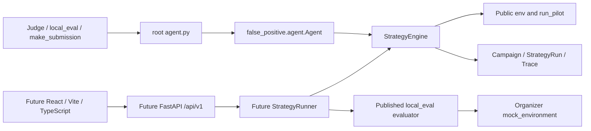
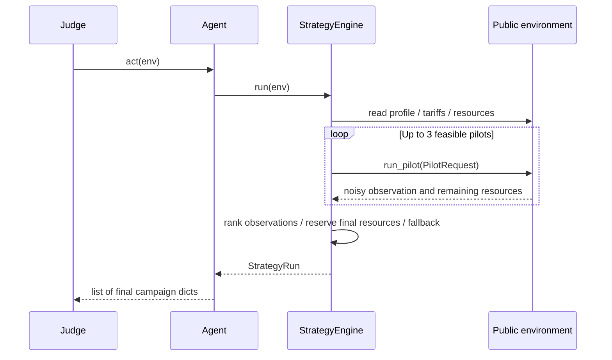

# Архитектура False Positive

## Цель и источники

Аналитик маркетинга выбирает тариф, аудиторию и канал при общем бюджете
100 000, 15 000 контактов и 20 пилотах. Эффекты неизвестны и исследуются
пилотами. Это bootstrap совместимого приложения, не оптимизация score.

Прочитаны PARTICIPANT_GUIDE.md, agent_template.py, environment.py,
mock_environment.py, scoring_core.py, local_eval.py, make_submission.py,
CSV-заголовки и справочники. 15 исходных файлов импортированы без изменения
байтов; SHA256 сохранены в `organizer-manifest.json`. Положение HackAlem
отдельно не предоставлено; PDF руководства сохранён вместе с Markdown.

Приоритет источников указан в AGENTS.md. Более строгие 5 минут из шаблона
приняты вместо 10 минут руководства. README обязателен по заданию bootstrap.

## Два независимых контура

Core импортирует только стандартную библиотеку (pandas в TYPE_CHECKING),
работает с публичными pandas DataFrame, полученными от среды. pandas/numpy
нужны официальным runtime-инструментам и включены в root requirements.
FastAPI/Pydantic, Node, HTTP и БД не входят в judge dependency graph.

## Компоненты и публичные границы

- `agent.py` реэкспортирует `false_positive.agent.Agent`; `act(env)` возвращает
  обычные dict, без trace и API metadata.
- `domain/models.py`: Campaign, PilotRequest, PilotObservation, ResourceState,
  Candidate, StrategyRun; модели dataclass, сериализация `to_dict()`.
- `AgentEnvironmentProtocol`: только профиль, тарифы, каналы, остатки,
  pilot_history и точная сигнатура run_pilot. В pilot kwargs нет campaign_name.
- `strategy/baseline.py`: группы current_tariff/arpu/data/call; следующая по
  публичной цене цель, при отсутствии — другой доступный тариф. Канал с
  минимальной публичной стоимостью. Ни истории эффектов, ни скрытой модели.
- `StrategyEngine.run(env, observer=None) -> StrategyRun`: до трёх пилотов,
  до 100 клиентов каждый; сохраняет хотя бы одну доступную финальную ячейку.
  Ранжирует наблюдения по оценке net, берёт положительные допустимые кампании.
- `DecisionAdvisor.rank(observations) -> list[int]`: перестановка индексов;
  некорректный ответ/ошибка заменяется DeterministicAdvisor.
- `fallback.py`: при отсутствии положительных результатов одна доступная
  кампания, предпочтительно лучшая измеренная. Отрицательный эффект возможен.
- TraceRecorder и observer записывают события; ошибка observer даёт warning,
  не меняет судейский план.

## Ресурсы и ошибки

Группы финального плана непересекающиеся; каждая содержит 1–5000 клиентов.
Пилоты пересекаются с финалом, их контакты оплачиваются отдельно. Планирование
использует реальные остатки после каждого вызова, даже если ответ оказался
ошибочным. Engine не выполняет финальные кампании и не изменяет их остатки
в env. `resources_after_plan` — резервирование по известным размерам групп.

Все отрицательные пилоты, RuntimeError пилота, ошибка advisor или observer
имеют fallback. Предпосылка — хотя бы одна непустая доступная ячейка,
поддерживаемый канал и тариф. Пустой/испорченный профиль или полностью
исчерпанные ресурсы дают явный ValueError; невозможно обещать ненулевую
валидную кампанию в таких условиях. Официальная стартовая среда проверена.

CSV содержит пропущенные сегменты: summary показывает UNKNOWN, baseline
исключает строки с пропусками в группировке. Ячейки >5000 тоже исключены,
а не обрезаются тайно. Для официального профиля кандидаты остаются.

`StrategyRun.pilots` содержит валидно разобранные наблюдения. Если среда
потратила ресурсы, но вернула некорректный ответ, такой вызов помечается
pilot_failed; его истинное выполнение остаётся в публичной pilot_history.
Будущий demo adapter должен сверить количество с evaluator n_pilots и
завершить run как failed при неполном trace, а не выдать неверные KPI.

## Demo, скоринг и API

Контракт в `contracts/openapi.yaml`, семантика и формулы — `contracts/README.md`.
Backend создаёт StrategyRunner и wrapper с `act(env)`, который ровно один
раз вызывает Engine и сохраняет StrategyRun. Для локального demo wrapper
передаётся опубликованному `local_eval.evaluate_agent(..., verbose=False)`.
Evaluator сам корректно учитывает точные пилотные ID и mock score. Core
не получает internals и не импортирует evaluator.

Evaluator перехватывает исключения Agent: adapter обязан проверить наличие
успешного StrategyRun и согласованность pilots/кампаний, иначе failed.
Не запускать Agent второй раз для KPI и не суммировать noisy pilot lift.
Evaluator использует относительные CSV-пути: сервер запускать из корня;
не делать process-wide chdir из concurrent requests. Отдельная свежая env
на каждый run, in-memory хранилище, без auth/БД. Перезапуск теряет run IDs.

Scorer n_campaigns включает пилоты, API n_campaigns — только финал.
Scorer PASS/FAIL означает финансовый знак, API status — жизненный цикл.
env остатки относятся только к пилотам; API остатки — к полному результату.
ROI inf при бесплатном push преобразуется в null с warning. Все значения
API сериализуются строгим JSON. Frontend не считает бизнес-результат сам.

## Расширения и ограничения

Можно заменить candidate generation, pilot policy, uncertainty estimation и
выбор финального плана, сохранив Agent/StrategyEngine и DTO-контракт.
LLM-порт пока только DecisionAdvisor, сетевой реализации нет. Будущая
реализация обязана иметь ключ из env, timeout, лимит вызовов, try/except,
валидацию и детерминированный fallback. Baseline не читает ключей или .env.

Микросервисы, обязательный Docker, БД, брокеры, auth и тяжёлые агентские
фреймворки не выбраны. Риски: шумные пилоты и отрицательный net, отличающиеся
hidden эффекты, недостоверные claims по fixtures, неправильное отображение
счётчиков scorer. Тесты и API-семантика защищают границы, не гарантируют score.
